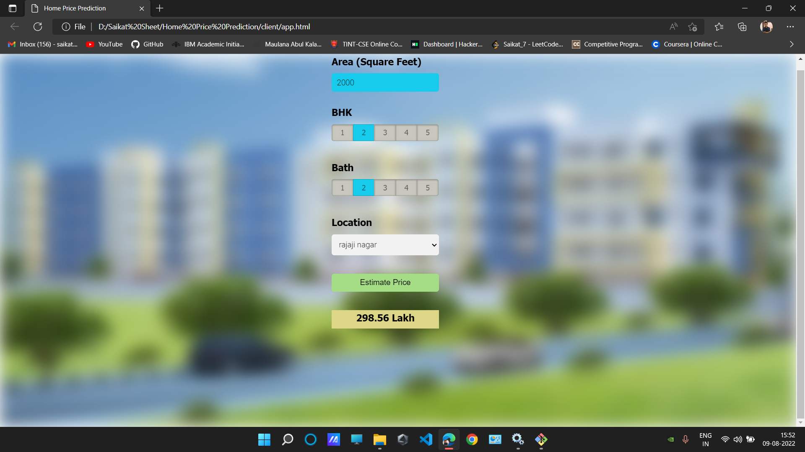

<h3 align="center">:office: Home Price Prediction :house_with_garden:</h3>

<h3 align="center">🔭 About 🔭</h3>

:sparkles: It is a data science project here a real estate home price prediction website has been build. At first a model is being build using sklearn and linear regression using home prices dataset which is being downloaded from kaggle.Thereafter a python flask server is being created that uses the saved model to serve http requests.Then to build the website html,css,javascript are being used that allows to enter home square feet area, bedrooms and bathrooms etc and it will call python flask server to retrieve the predicted price.

<h3 align="left">🔭 Tools Used 🔭</h3>

1.Python.

2.Numpy and Pandas for data cleaning.

3.Matplotlib for data visualization.

4.Sklearn for model building.

5.Jupyter notebook, visual studio code and pycharm as IDE.

6.Python flask for http server.

7.HTML,CSS,Javascript for UI.

  
